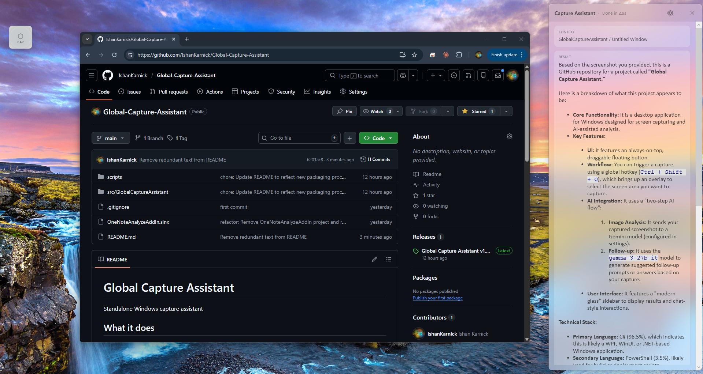
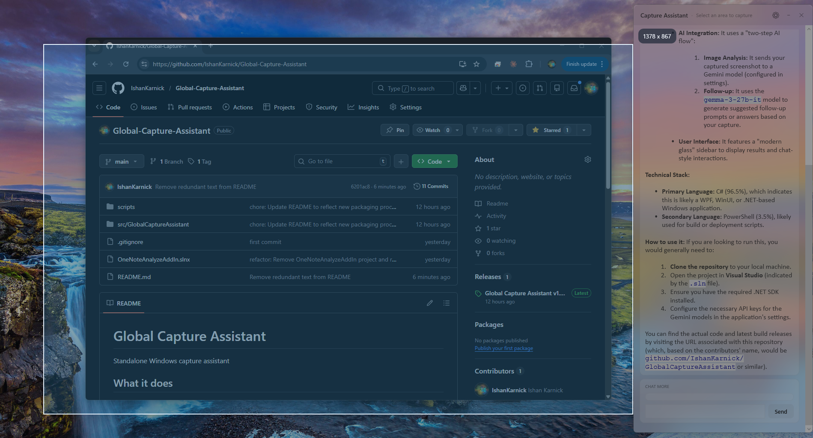
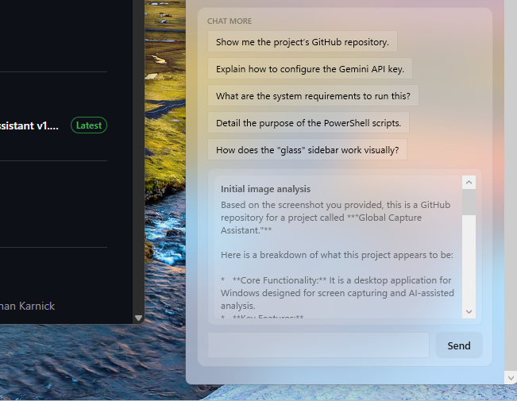

# Global Capture Assistant

Always-on-top Windows screenshot assistant with built-in AI analysis and follow-up chat.

I built this because I got tired of how clumsy the normal screenshot-to-LLM workflow felt. Taking a screenshot, pasting it into ChatGPT, waiting for a response, then constantly switching back and forth to compare the answer with what I was actually doing kept breaking my concentration. Even split-screening everything felt awkward because I was rearranging my desktop just to make the tool usable. I wanted the answer to stay visible beside my work instead of disappearing into another tab or window. So I built this as a selfish tool first, mainly to remove that friction from my own day-to-day workflow.

- Windows desktop app
- WPF / .NET 8
- Global hotkey: `Ctrl + Shift + Q`
- Gemini API key required
- WebView2 used for note-card rendering
- Floating button + tray + sidebar workflow



## Screenshots

### Capture overlay
Region capture overlay with the selection workflow visible.



### Follow-up chat
Suggested prompts and the chat-more loop after the first analysis.



## Why I Built This

Most screenshot-to-LLM workflows are not really slow because of the screenshot itself. The real drag is the context switching that starts right after it: capture something, paste it somewhere else, wait, compare, switch back, then do it again. I wanted a setup where the capture, the answer, and the next useful prompts all lived in one persistent workspace. This app is built around staying in flow while working, not around generic image upload.

## What It Does

- Draggable always-on-top floating capture button
- Global hotkey: `Ctrl + Shift + Q`
- Tray icon with `Capture Now` and `Show Sidebar` actions
- Region selection overlay for captures
- Active-window context attached to captures when available
- Result sidebar with Markdown rendering
- Suggested follow-up prompts after each analysis
- Manual chat input for continuing analysis on the same capture
- `Generate Notes` action that turns the current capture into a styled note card
- HTML/CSS note card rendered in-app and copied to the clipboard as a PNG
- In-app preview of the generated notes card image
- Retry support after failures
- Model selection and thinking level settings
- Optional auto-start and focus-sidebar behavior
- API key stored locally with Windows DPAPI
- Local logging for diagnostics

## How It Works

1. Trigger a capture from the floating button, tray icon, or global hotkey.
2. Select the part of the screen you want to analyze.
3. The capture is sent to your configured Gemini model for image analysis.
4. The sidebar shows the response, generates suggested follow-up prompts with `gemma-3-27b-it`, and lets you continue the conversation without recapturing.
5. If you want something reusable, click `Generate Notes` to have Gemini produce a visual note card that is rendered in-app and copied to your clipboard as a PNG.

## Quick Start

Prerequisites:

- Windows 10/11
- Gemini API key
- Microsoft Edge WebView2 Runtime
- `.NET 8 SDK` if you are building from source

Download a release:

- If you do not want to build from source, download `GlobalCaptureAssistant-1.0.0-win-x64.zip` from the [GitHub releases page](https://github.com/IshanKarnick/Global-Capture-Assistant/releases/).
- Extract the ZIP and run `GlobalCaptureAssistant.exe`.

Run from source:

```powershell
dotnet restore
dotnet build src\GlobalCaptureAssistant\GlobalCaptureAssistant.csproj -c Debug
dotnet run --project src\GlobalCaptureAssistant\GlobalCaptureAssistant.csproj -c Debug
```

## First Run

- The app prompts for your Gemini API key the first time you try to use AI capture features.
- The key is stored locally with Windows DPAPI in `%AppData%\GlobalCaptureAssistant\settings.json`.
- The app supports auto-start and focus-sidebar behavior by default, and both can be changed from the sidebar settings.

## Daily Workflow

1. Start a capture from the floating button, the tray icon, or `Ctrl + Shift + Q`.
2. Drag over the part of the screen you want to analyze.
3. Read the response in the sidebar while keeping your original work visible.
4. Click a suggested prompt or type your own follow-up question.
5. Click `Generate Notes` if you want the current capture turned into a styled note card image.
6. Paste the generated PNG directly into OneNote or another app, or keep using the same capture conversation without taking a new screenshot unless the context changes.

## Build From Source

The main project lives at `src\GlobalCaptureAssistant`.

```powershell
dotnet restore
dotnet build src\GlobalCaptureAssistant\GlobalCaptureAssistant.csproj -c Debug
```

## Package a Local Release

Use the packaging script to produce a local ZIP release from the current source tree.

```powershell
.\scripts\package-release.ps1
```

Optional examples:

```powershell
.\scripts\package-release.ps1 -Version 1.0.0 -Runtime win-x64
.\scripts\package-release.ps1 -Version 1.0.0 -FrameworkDependent
```

Packaging notes:

- Default runtime is `win-x64`
- Self-contained single-file publish is the default
- `-FrameworkDependent` switches packaging to framework-dependent output
- Release artifacts are written to `artifacts\release\`

Expected output:

- `artifacts\release\GlobalCaptureAssistant-<version>-win-x64.zip`
- `artifacts\release\GlobalCaptureAssistant-<version>-win-x64.zip.sha256`

## Configuration and Storage

- Settings file: `%AppData%\GlobalCaptureAssistant\settings.json`
- Logs directory: `%LocalAppData%\GlobalCaptureAssistant\logs\`
- Configurable options currently include:
  - selected Gemini model
  - thinking level
  - auto-start
  - focus sidebar after capture
- The Gemini API key is stored locally with Windows DPAPI.

## Troubleshooting and Current Limitations

- If the global hotkey is unavailable, use the floating button or tray menu.
- If your Gemini API key is missing, the app cannot analyze captures.
- `Generate Notes` depends on WebView2 being available on the machine.
- Internet access is required for model calls.
- This app is currently Windows-only.

## Project Structure

- `src/GlobalCaptureAssistant` - app source
- `scripts/package-release.ps1` - local release packaging
- `docs/screenshots` - README image assets

## License

Licensed under Apache-2.0. See [LICENSE](LICENSE).

## Contributing

Contributions are welcome. See [CONTRIBUTING.md](CONTRIBUTING.md).
